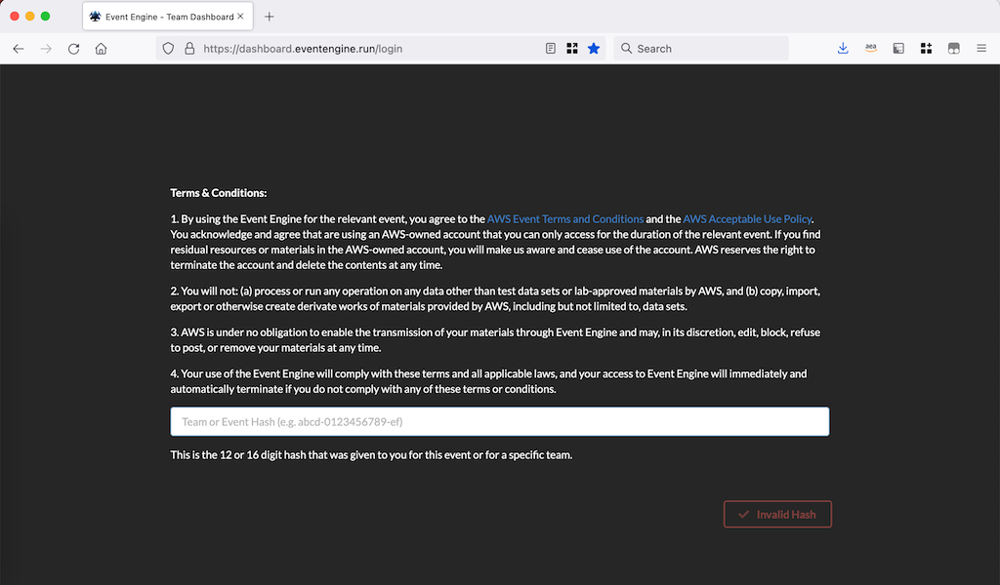
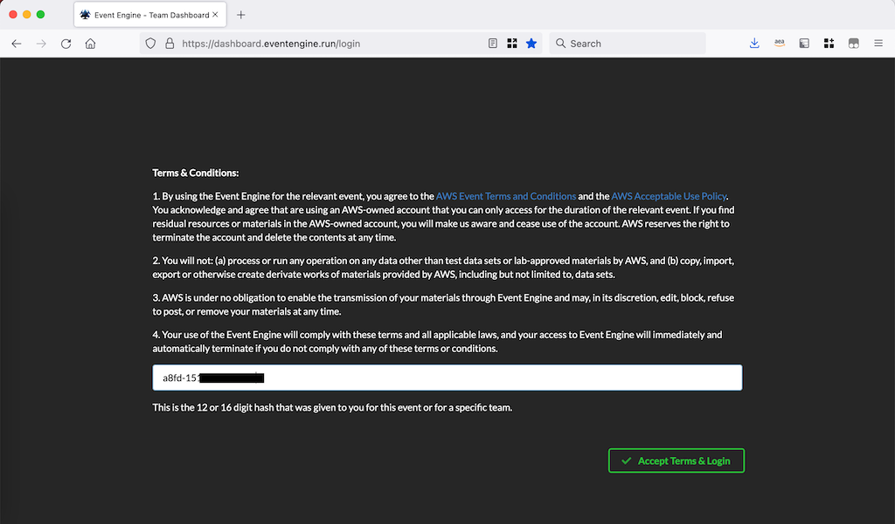
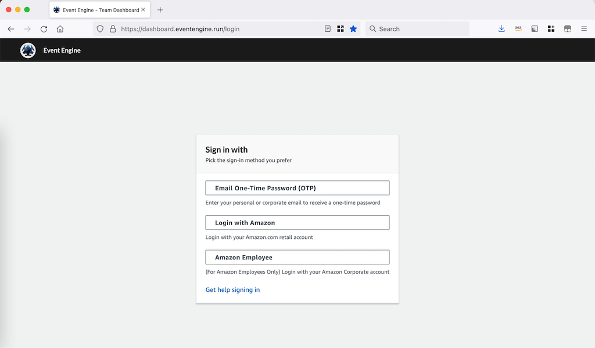
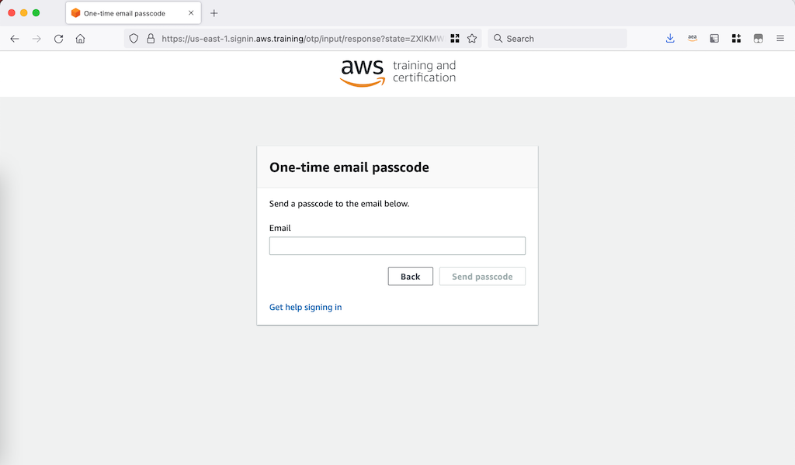
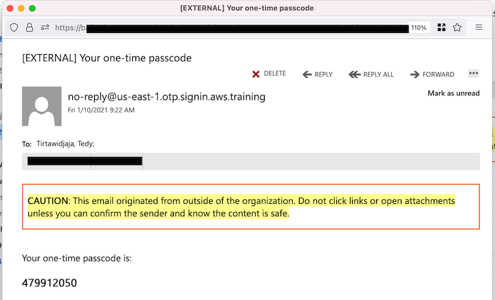
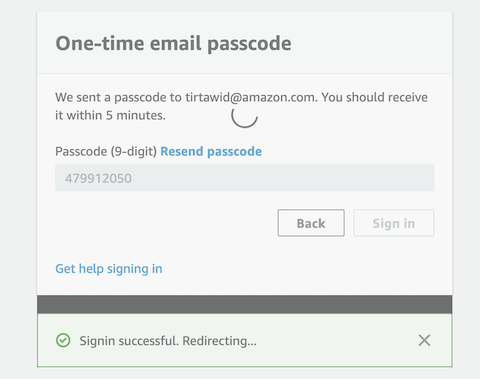
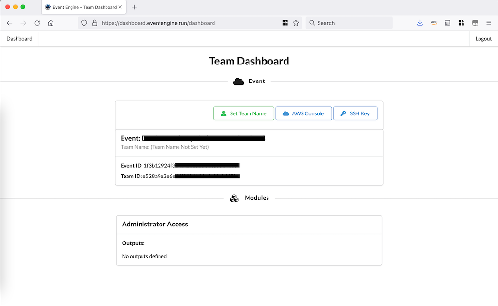
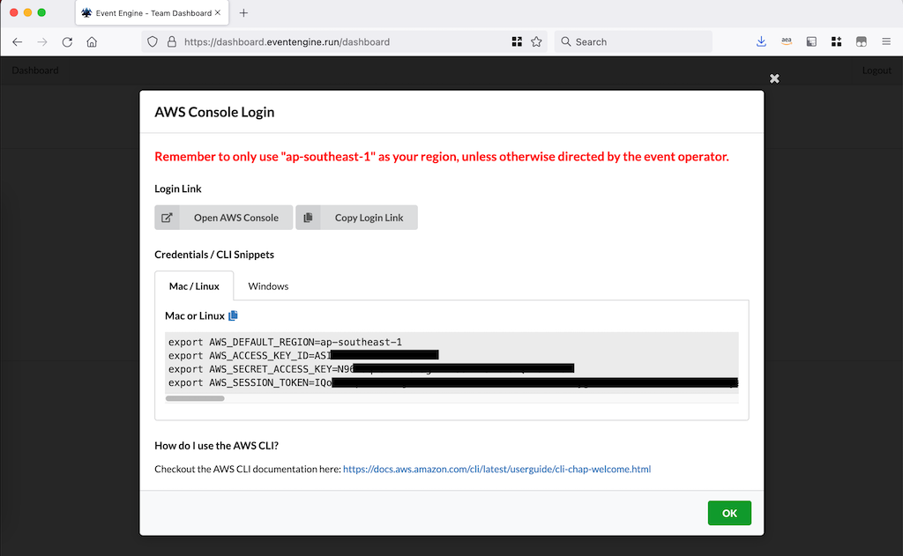
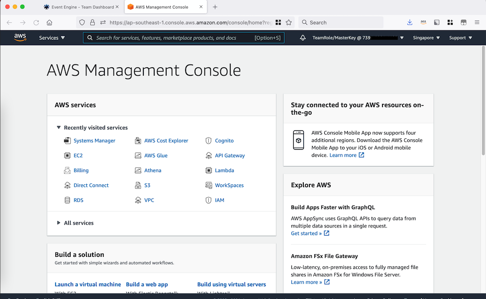

# Lab Guide

In this workshop we will use Event Engine as the lab environment. Event Engine will provide you with a temporary AWS account so that you can experiment with the lab contents.

To access Event Engine follow the following instructions:

1. Using your web browser open [https://dashboard.eventengine.run](https://dashboard.eventengine.run).

    

2. Enter the hash key provided by the instructor.

    

3. Get the OTP by click the "Email One-Time Password (OTP)" menu.
    
    

4. Input your email that you have submitted to the event organizer. The OTP will be delivered only to the email that has been registered. If you want to use different email address, please notify the event organizer.

    

5. Check your email Inbox (and Spam folder as well) to get the 9 digit OTP.
    
    

6. Enter the OTP and click Sign in button.
    
    

7. Upon successful login you will be redirected to the Team Dashboard page.

    

    To access AWS Management Console, click on the AWS Console.

9. On the pop-up window you can click on Open AWS Console menu or using Access Key (should you want to use AWS CLI instead of Web browser).

    

10. When you click Open AWS Console, you will be redirected to the AWS Management Console like the following screenshot:

    

11. Now you can run lab scenario provided by the Event Organizer.